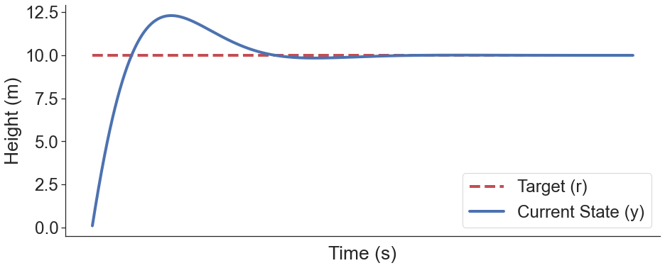
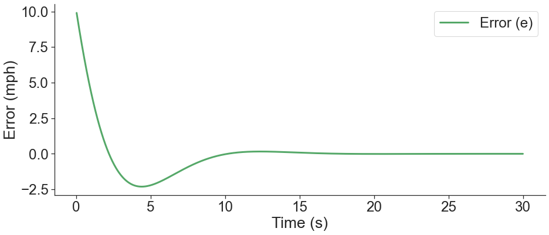

# PID notebook

This notebook simulates a PID controller, and plot the outputs as we vary controller gains.
**PID Controller Basics**

A PID controller is a widely used feedback control system in engineering and automation. It is designed to regulate a system's output (e.g., temperature, position, speed) by adjusting a control input (e.g., valve position, motor speed) based on the error between the desired setpoint and the measured process variable.

The PID controller consists of three components:

1. **Proportional (P) Term:** The proportional term produces an output signal ($ U_P(t) = K_p \cdot e(t) $) where:
   - $ U_P(t) $ is the proportional term output.
   - $ K_p $ is the proportional gain (a tuning parameter).
   - $ e(t) $ is the error at time $ t $.

2. **Integral (I) Term:** The integral term eliminates steady-state error by accumulating past errors over time ($ U_I(t) = K_i \cdot \int_0^t e(\tau) d\tau $) where:
   - $ U_I(t) $ is the integral term output.
   - $ K_i $ is the integral gain (a tuning parameter).
   - $ e(\tau) $ is the error over time $ \tau $, integrated from 0 to $ t $.

3. **Derivative (D) Term:** The derivative term predicts future error trends and helps to reduce overshoot and oscillations ($ U_D(t) = K_d \cdot \frac{de(t)}{dt} $) where:
   - $ U_D(t) $ is the derivative term output.
   - $ K_d $ is the derivative gain (a tuning parameter).
   - $ \frac{de(t)}{dt} $ is the rate of change of error with respect to time.

The final control output of the PID controller is the sum of these three terms ($ U(t) = U_P(t) + U_I(t) + U_D(t) $).

In practice, tuning the values of $ K_p $, $ K_i $, and $ K_d $ is crucial to achieve the desired system performance, balancing between fast response, stability, and minimal overshoot.

PID controllers are used in a wide range of applications, from temperature control in ovens to autopilots in aircraft, and they provide a versatile and effective means of controlling various dynamic systems.


```python
import time

class PID:
    """PID Controller
    """

    def __init__(self, P=0.0, I=0.0, D=0.0, current_time=None):

        self.Kp = P
        self.Ki = I
        self.Kd = D

        self.sample_time = 0.00
        self.current_time = current_time if current_time is not None else time.time()
        self.last_time = self.current_time

        self.clear()

    def clear(self):
        """Clears PID computations and coefficients"""
        self.SetPoint = 0.0
        self.PTerm = 0.0
        self.ITerm = 0.0
        self.DTerm = 0.0
        self.last_error = 0.0
        self.output = 0.0

    def update(self, feedback_value, delta_time):
        """Calculates PID value for given reference feedback
        .. math::
            u(t) = K_p e(t) + K_i \int_{0}^{t} e(t)dt + K_d {de}/{dt}
        .. figure:: images/pid_1.png
           :align:   center
           Test PID with Kp=1.2, Ki=1, Kd=0.001 (test_pid.py)
        """
        error = self.SetPoint - feedback_value
        delta_error = error - self.last_error 

        self.PTerm = self.Kp * error 
        self.ITerm += error * delta_time
        self.DTerm = delta_error / delta_time

        # Remember last time and last error for next calculation
        self.last_time = self.current_time
        self.last_error = error

        self.output = self.PTerm + (self.Ki * self.ITerm) + (self.Kd * self.DTerm)
```


```python
import time
import matplotlib.pyplot as plt
import numpy as np
from scipy.interpolate import interp1d
import seaborn as sns


P = 0.01 # weight current errors more
I = 0.004
D = 0.0 # ignore future potential errors 

NUM_STEPS = 2000 # number of iterations
SIM_TIME = 30
TRIGGER_TIME = 0 #what time to ping the signal
TARGET = 10
DELTA_TIME = SIM_TIME / NUM_STEPS

pid = PID(P, I, D)

feedback = 0
feedback_list = []
time_list = []
setpoint_list = []
error_list = []

cum_error = 0
cum_error_list = []

bang_bang_list = []
bang_acc = 0.1
speed = 0


for i in range(1, NUM_STEPS):    
    pid.SetPoint = TARGET if i >= TRIGGER_TIME/DELTA_TIME else 0.0
    pid.update(feedback, DELTA_TIME)
    feedback += (pid.output)
    feedback_list.append(feedback)
    setpoint_list.append(pid.SetPoint)
    error_list.append(pid.SetPoint - feedback)

    cum_error += (pid.SetPoint - feedback)
    cum_error_list.append(cum_error)

    time_list.append(i*DELTA_TIME)


custom_params = {"axes.spines.right": False, "axes.spines.top": False, "figure.figsize":(15, 6)}
sns.set_theme(style = "ticks", rc =custom_params, font_scale=2.2)
sns.lineplot(x = time_list, y = setpoint_list, color = 'r', linestyle='--', linewidth =4, label = "Target (r)")
sns.lineplot(x = time_list, y = feedback_list, linewidth = 4, label = "Current State (y)", color = "b").set(title = "",
                                                  xlabel = "Time (s)",
                                                  xticklabels = [],
                                                  ylabel = "Height (m)")
plt.tick_params(bottom=False)
plt.show()


# sns.lineplot(x = time_list, y = cum_error_list, linewidth = 3, label = "Cumulative Error", color = "orange")
sns.lineplot(x = time_list, y = error_list, linewidth = 3, label = "Error (e)", color = "g").set(title = "",
                                                  xlabel = "Time (s)",
                                                  ylabel = "Error (mph)")
# sns.lineplot(x = time_list, y = cum_error_list, linewidth = 3, label = "Cumulative Error", color = "orange")
# sns.lineplot(x = time_list, y = cum_error_list, linewidth = 3, label = "Cumulative Error", color = "pink").set(title = "",
#                                                   xlabel = "Time (s)",
#                                                   ylabel = "Error (mph)")
# plt.show()
```


    

    [Text(0.5, 1.0, ''), Text(0.5, 0, 'Time (s)'), Text(0, 0.5, 'Error (mph)')]


    

